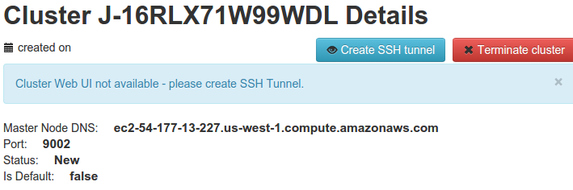

Clusters
========

Clusters it's Amazon EMR Cluster, that are creaating automaticaly while importing dataset with Hadoop Pig. List of all clusters could be found on `this page <http://cloudml.int.odesk.com/#/aws/clusters>`_.

.. note::

	The link to the cluster, which was used while importing datased, would be displayed on DataSet details page. :ref:`More information <importing_dataset_with_pig_datasource>`.

Accessing to Hadoop Web UI
--------------------------

To get access to Web UI you need to create SSH Tunnel by clicking `Create SSH tunnel` button on the right-top corner of the page.

After that the link to Web UI become available.