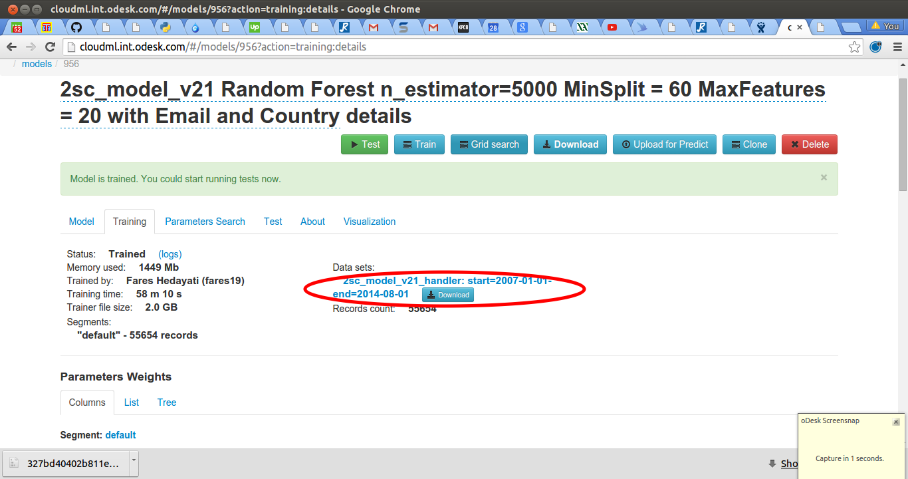

==============
Exporting data
==============

Export vectorized data
======================

.. _export_test_examples_to_db:

Export test examples to database
================================

For exporting test examples to the database you need to:

* :ref:`create <reating-predefined-datasources>` a predefined datasource to connect to the database or use existing one.

.. _creating-predefined-datasources:

Creating data sources
---------------------

Defines the information about database connection.

Following attributes are available:

============  ========   ===========
Name          Required   Description
============  ========   ===========
name          yes        A name uniquely identifying this database. In the future this should be required so that queries can refer to which DB connection to use for executing
type   		  yes        Currently only 'sql' is supported.
db.conn       yes        This is field 'conn' defined A connection string containing the DB connection details
db.vendor     yes        The name of the database's vendor. Currently only 'postgres' is supported.
============  ========   ===========
