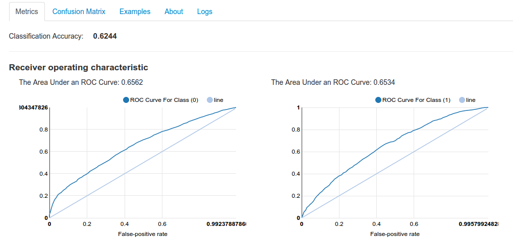
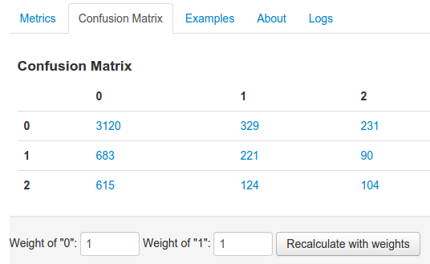
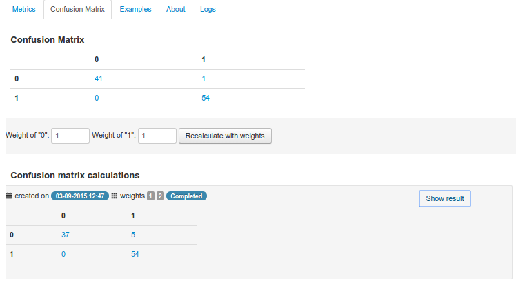

.. _test_metrics:

====================
Evaluating the Model
====================

After testing the model user gets a set of test metrics.

There are two types of the models:

* classification
* regression

So for classification models would be available :ref:`classfication metrics <classifier_test_metrics>`, for regression - :ref:`regression metrics <regression_test_metrics>`.

They could be found in the `Metrics` tab of the Test details. Confusion Matrics would be displayed in the separate tab.

.. _classifier_test_metrics:

Classifier Test Metrics
=======================

This metrics would be available for classifiers:

* Logistic Regression
* Stochastic Gradient Descent Classifier
* Decision Tree Classifier
* Gradient Boosting Classifier
* Extra Trees Classifier
* Random Forest Classifier

Classification Accuracy
-----------------------

The classification accuracy depends on the number of test examples correctly classified (true positives plus true negatives) and is evaluated by the formula:

:math:`accuracy = \frac{t}{n}`

where

:math:`t` - number of sample cases correctly classified

:math:`n` - total number of test examples.

Receiver operating characteristic
---------------------------------

Receiver Operating Characteristic (ROC) metrics used to evaluate classifier output quality.

ROC curves typically feature true positive rate on the Y axis, and false positive rate on the X axis. This means that the top left corner of the plot is the “ideal” point - a false positive rate of zero, and a true positive rate of one. This is not very realistic, but it does mean that a larger area under the curve (AUC) is usually better.

For binary classification we will have one 
The Area Under an ROC Curve and for multiclass classification we will have one for each class.

Above each ROC curve also The Area Under an ROC Curve displayed:

Confusion Matrix
----------------

Confusion Matrix would be available in "Confusion Matrix" tab in test details page. It appears after test would be successful completed:

Recalculating Confusion Matrics with class weights
~~~~~~~~~~~~~~~~~~~~~~~~~~~~~~~~~~~~~~~~~~~~~~~~~~

It possible to recalculate the confusion matrics with specific weights of each class. You need to use a form under the confusion matrics:

It will be iterate over all test examples to get a probability of the each class. Then for each example system apply class weights to this probabilities using formulas:

:math:`sum = \sum_{i=1}^{n} w_{i} * prob_{i}`,

where

:math:`n` - count of the model classes

:math:`w_{i}` - i-class weight (specified by user)

:math:`prob_{i}` - probability of i-class value for specified test example.

So new weighted probabilities of each class will be equals:

:math:`nprob_{i} = w_{i} * prob_{i} / sum`

Using new probabilities of the classes system will determine new predicted value for each test example. And after that system calculates a confusion matrix with new predicted values.

Precision Recall Metrics
------------------------

Precision is a measure of result relevancy, while recall is a measure of how many truly relevant results are returned. A high area under the curve represents both high recall and high precision, where high precision relates to a low false positive rate, and high recall relates to a low false negative rate. High scores for both show that the classifier is returning accurate results (high precision), as well as returning a majority of all positive results (high recall).

A system with high recall but low precision returns many results, but most of its predicted labels are incorrect when compared to the training labels. A system with high precision but low recall is just the opposite, returning very few results, but most of its predicted labels are correct when compared to the training labels. An ideal system with high precision and high recall will return many results, with all results labeled correctly.

In case of binary classification in Metrics tab of the Test details page you could found precision recall curve.

.. note::

	Precision Recall Metrics now are available only for binary classification.

.. _regression_test_metrics:

Regression Test Metrics
=======================

Support vector regression tests will have following metrics:

* Explained variance regression score
* Mean absolute error regression loss
* Mean squared error regression loss
* R^2 (coefficient of determination) regression