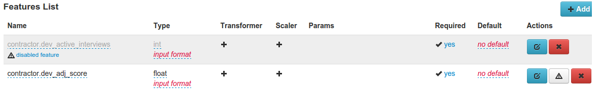
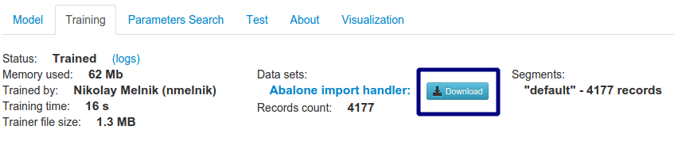
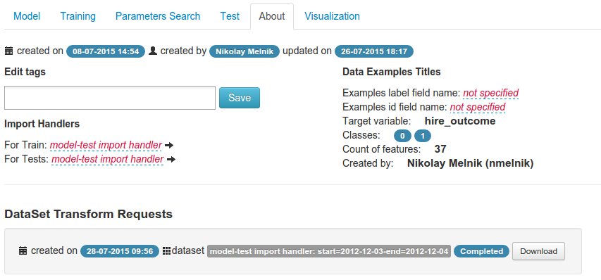
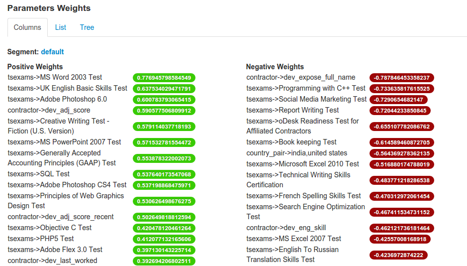
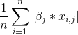
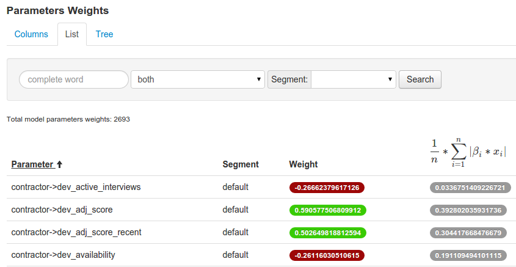
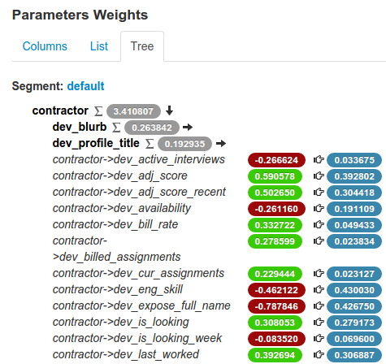
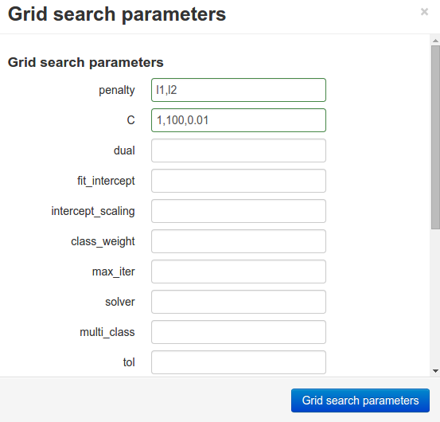
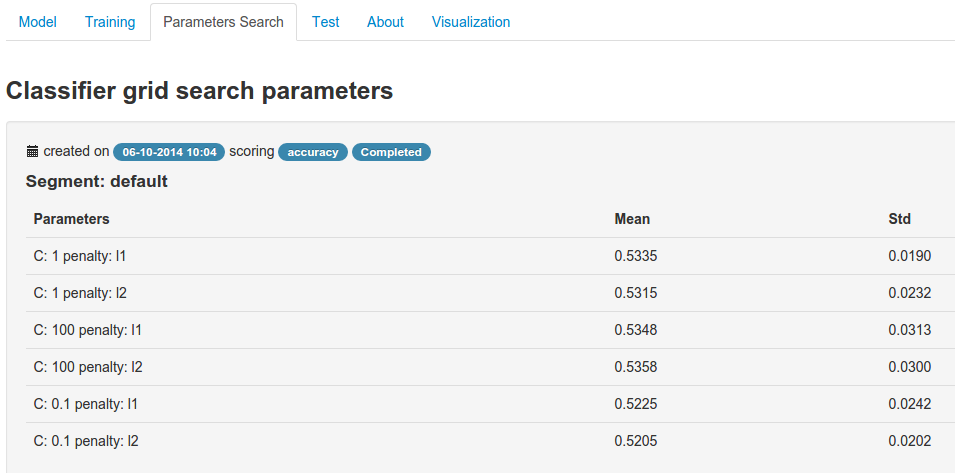

Working with Models
===================

The model is the main entity in the cloudml project. It is a classifier with set of features and other parametes.

.. contents:: 
   :depth: 4

There are information about classifier and features on the model tab.

Edditing features
-----------------

Removing/disabling features
~~~~~~~~~~~~~~~~~~~~~~~~~~~

If you don't want to use the feature, when train the model, you have two ways:

* remove
	by clicking to the red button delete in the actions column
* disable
	by clicking to the grey button disable in the actions column

.. _download_transformed_train_dataset:

Working with transformed datasets
---------------------------------

To download vectorized data, that has been used for model trainer go to the "Training" tab and click to the download button near dataset name, that was used for training:

Preparing vectorized version of the dataset is a background operation, and when it would be completed on the "About" tab appears section "DataSet Transform Requests":

Click to Download button and you will have .npz archive with vectorized data.

Sample usage data in your script:

.. code-block:: python

	>>> import numpy
	>>> dataset = numpy.load(path_to_npz_file)['default.npy'].tolist() 
	>>> dataset['X']
	<n x m sparse matrix>
	>>> dataset['Y']
	<list with n - elements>

Model feature weights
---------------------

For different classifiers we use different parameters as feature weights:

* `LogisticRegression <http://scikit-learn.org/stable/modules/generated/sklearn.linear_model.LogisticRegression.html#sklearn.linear_model.LogisticRegression>`_
	`coef_` - coefficient of the features in the decision function
* `SGDClassifier <http://scikit-learn.org/stable/modules/generated/sklearn.linear_model.SGDClassifier.html#sklearn-linear-model-sgdclassifier>`_
	`coef_` - weights assigned to the features.
* `SVR <http://scikit-learn.org/stable/modules/generated/sklearn.svm.SVR.html#sklearn-svm-svr>`_
	`coef_` - weights assigned to the features (coefficients in the primal problem). This is only available in the case of linear kernel.
* `Decision Tree Classifier <http://scikit-learn.org/stable/modules/generated/sklearn.tree.DecisionTreeClassifier.html>`_
	`feature_importances_` - the feature importances. The higher, the more important the feature. The importance of a feature is computed as the (normalized) total reduction of the criterion brought by that feature. It is also known as the Gini importance
* `ExtraTreesClassifier <http://scikit-learn.org/stable/modules/generated/sklearn.ensemble.ExtraTreesClassifier.html>`_
	`feature_importances_` - the feature importances (the higher, the more important the feature).
* `RandomForestClassifier <http://scikit-learn.org/stable/modules/generated/sklearn.ensemble.RandomForestClassifier.html>`_
	`feature_importances_` - the feature importances (the higher, the more important the feature).
* `GradientBoostingClassifier <http://scikit-learn.org/stable/modules/generated/sklearn.ensemble.GradientBoostingClassifier.html>`_
	`feature_importances_` - the feature importances (the higher, the more important the feature).

Also on the List tab there are normalized weight, calculated as:

where:

- n - row count in train dataset
- betta(j) - weight of the selected feature
- x(i, j) - value of the selected feature for i-row in the dataset

It used  to analyze, whether weights parameter is important with this data.

On the tree tab there are also a child nodes normalized weight sum for not leaf nodes. It displays after sigma symbol. Weights on the tree view is from red to green, normalized weights have grey color.

.. _pickled_models:

Pickled Models
--------------

System stores pickled Trainer class for the model in Amazon S3.
Trainer could use the configuration defined in model features and perform the training of the classifier. The trainer can also perform testing of the generated model. 

The underlying implementation supporting the trainer is based on Python's `scikit-learn <http://scikit-learn.org>`_ package.

You could download model trainer from existing model by clicking "download trainer" in the top of the model details page.
Don't forget, that model should be trained before.

.. image:: ./_static/models/download-trainer.png
	:width: 800px

You could load already trained model by specify trainer file in the `upload model page <http://cloudml.int.odesk.com/#/upload_model>`_.

Model Parameters Grid Search
----------------------------

Searches over specified parameter values for an classifier.
As the underlying implementation used `Scikit GridSearchCV <http://scikit-learn.org/stable/modules/generated/sklearn.grid_search.GridSearchCV.html#sklearn-grid-search-gridsearchcv>`_

For starting parameters grid search click to "Grid search" button on the right-top corner of the model details page.

In opened popup you should choose classifier parameters, dataset for training, dataset for testing and model evaluation metrics.

Searching the best classifier parameters is the background process, so navigate to "Parameters Search" tab to view results:

Seems the best parameters are "C: 100, penalty: l2".