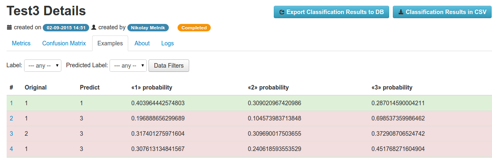

=======================
Analyzing Test Examples
=======================

Listing Test Examples
=====================

After test would be completed, all data rows used for testing, called Test Examples stored in the database.
To view them you need to navigate to the `Examples` tab in the Test details page:

In the examples table there are following columns:

* Original - value of the target variable in the original dataset's row
* Predict - value of the target variable, predicted using trained model
* <<class>> probability - probabilities of each class, predicted using the trained model

.. note::

	Correctly predicted test examples are with green background, mistakenly - with red.

Text Example Details
--------------------

You could open details page by clicking to any test example in the list tab.

There are following tabs:

* Features - table of the features, weights and vectorized values
* Weighted Data - list of features with it's weight
* Raw Data - raw data that was used for predicting target variable, when the test was runned.

Features tab
~~~~~~~~~~~~

There are a table with following columns:

* Name - name of the feature (is same to the model's feature name)
* Model Weight - weight of this feature in the trained model (very often it would be a model's feature coef)
* Vectorized Value - the vectorized value of the feature, that is passed to the model to predict a probabilities of the target variable. It isn't a real value, this one could be found in Weighted Data tab.
* Weight - feature's value weight, calculated as:

:math:`weight = value_vectorized * weight_model`

Weighted Data
~~~~~~~~~~~~~

On this tab shows a list of the features, their values with weights. Red/green colors used to show which features have negative/positive weight.

It could be useful, when analyzing test example with text fields - significant words of this feature will be displayed with it's weight.

.. image:: ./_static/tests/example_details.png

When hover the mouse to the value, there are information about model weight, vectorized value and weight in the tooltip.

Average Precision
=================

